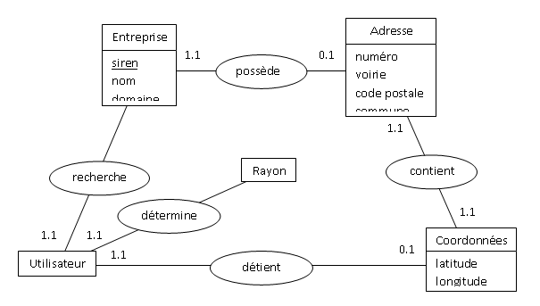
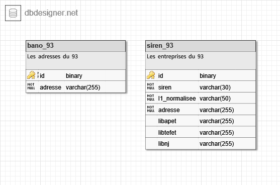
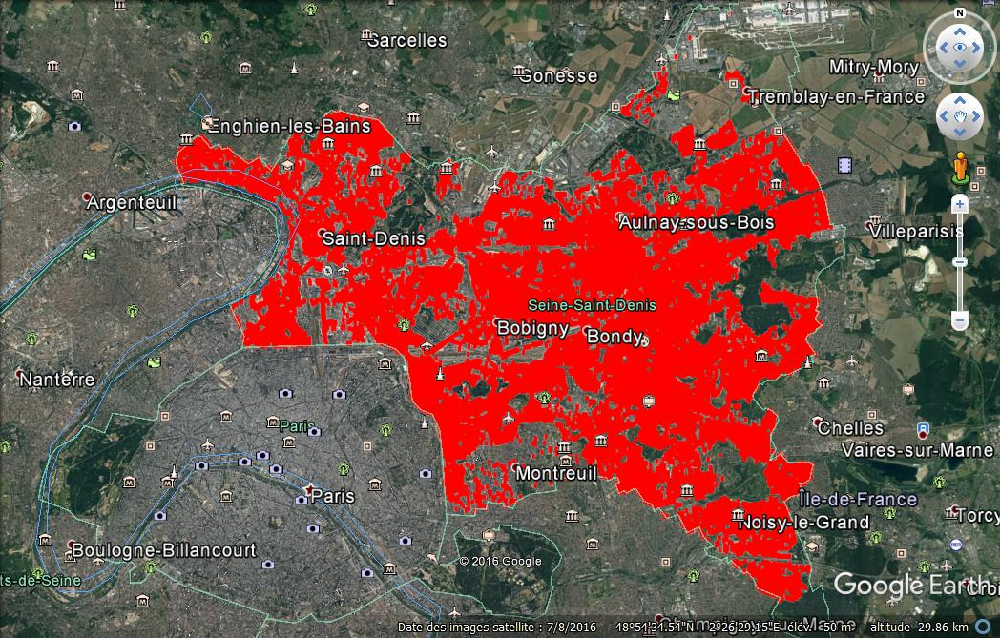

# Entrepises de Seine-Saint-Denis
## Projet Bases de Données avancées 2017
### Modèle Conceptuel de Données ou Modèle Entité-Association

### Modèle Logique de Données  

### Création de la Base de Données
```sql
CREATE TABLE "siren_93" (
  "id" serial NOT NULL UNIQUE,
  "siren" varchar(30) NOT NULL,
  "l1_normalisee" varchar(50) NOT NULL,
  "adresse" varchar(255) NOT NULL,
  "libapet" varchar(255),
  "libtefet" varchar(255),
  "libnj" varchar(255),
  CONSTRAINT siren_93_pk PRIMARY KEY ("id")
) WITH (  
  OIDS=FALSE
);

CREATE TABLE "bano_93" (
  "id" serial NOT NULL UNIQUE,
  "adresse" varchar(255) NOT NULL,
  CONSTRAINT bano_93_pk PRIMARY KEY ("id")
) WITH (  
  OIDS=FALSE
);

SELECT AddGeometryColumn('bano_93','the_geom','4326','POINT',2);
```
```sql
CREATE EXTENSION postgis
```
### Insertion des données dans la Base de Données
```python
import psycopg2
import csv
import re # regular expression
import sys

con = None

bano_93 = open("bano_93.csv")
siren_93 = open("siren_93.csv")

try:

    con = psycopg2.connect(host='localhost',dbname='Entreprises_de_Seine-Saint-Denis',user='postgres',password='postgres',port=5432)
    cur = con.cursor()

    try:

        reader = csv.reader(bano_93)
        exp = "([0-9]+)"

        for row in reader:
            
            #print(row)
            ligne = ";".join(row)
            #print(ligne)
            tableau = ligne.split(";")
            #print(tableau)

            if tableau[1].find("B") != -1: # si c est un BIS

                numero = re.findall(exp,tableau[1]) # extraction du numero
                adresse = numero[0]+" B "+tableau[8]+" "+tableau[3]+" "+tableau[9] # "numero B voie_maj code_post ville_maj"

            elif tableau[1].find("Q") != -1 and tableau[1].find("T") != -1: # sinon si c est un QUATER

                numero = re.findall(exp,tableau[1]) # extraction du numero
                adresse = numero[0]+" Q "+tableau[8]+" "+tableau[3]+" "+tableau[9] # "numero Q voie_maj code_post ville_maj"
                
            elif tableau[1].find("T") != -1: # sinon si c est un TER

                numero = re.findall(exp,tableau[1]) # extraction du numero
                adresse = numero[0]+" T "+tableau[8]+" "+tableau[3]+" "+tableau[9] # "numero T voie_maj code_post ville_maj"

            else: # sinon

                adresse = tableau[1]+" "+tableau[8]+" "+tableau[3]+" "+tableau[9] # "numero voie_maj code_post ville_maj"

            cur.execute("INSERT INTO bano_93 (adresse,the_geom) VALUES('"+adresse+"', ST_GeomFromText('POINT("+tableau[7]+" "+tableau[6]+")', 4326))")

    finally:

        bano_93.close()

    try:

        reader = csv.reader(siren_93)

        for row in reader:

            #print(row)
            ligne = ";".join(row)
            #print(ligne)
            tableau = ligne.split(";")
            #print(tableau)

            adresse = tableau[5]+" "+tableau[20]+" "+tableau[28] # "l4_normalisee codpos libcom"
            cur.execute("INSERT INTO siren_93 (siren,l1_normalisee,adresse,libapet,libtefet,libnj) VALUES('"+tableau[0]+"','"+tableau[2]+"','"+adresse+"','"+tableau[43]+"','"+tableau[46]+"','"+tableau[71]+"')")

    finally:

        siren_93.close()
    
    con.commit()

#except (psycopg2.DatabaseError, e):

    #if con:

        #con.rollback()

    #print ('Error %s' % e)    
    #sys.exit(1)

finally:

    if con:

        con.close()
```
### Jonction des 2 tables
```sql
CREATE TABLE siren_93_coord AS
SELECT siren_93.id, siren_93.siren, siren_93.l1_normalisee, siren_93.adresse, bano_93.the_geom, siren_93.libapet, siren_93.libtefet, siren_93.libnj
FROM bano_93
INNER JOIN siren_93
ON siren_93.adresse = bano_93.adresse

Query returned successfully: 125857 rows affected, 7.7 secs execution time sans index
Query returned successfully: 125857 rows affected, 8.9 secs execution time avec des index (btree) sur les adresses
```
### Résultat visuel

KML exporté de GeoServer
### Requête de sélection
```sql
SELECT *
FROM siren_93_coord
WHERE ST_DistanceSphere(the_geom, ST_GeomFromText('POINT(position)', 4326)) < rayon
--AND libapet = 'activité'
```
